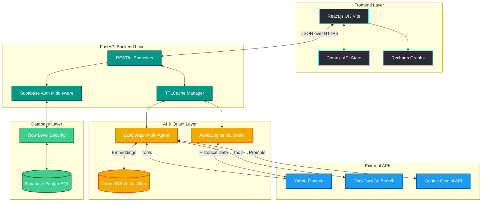

# 💹 Finsights Nexus: The Autonomous AI Wealth Manager

<div align="center">
  
  
  
  
  
</div>

<br/>

**Finsights Nexus** is a state-of-the-art, full-stack, AI-driven wealth management and portfolio analysis platform. Built as a microservice architecture, it bridges the critical gap between retail investing and institutional-grade quantitative analysis. By integrating deterministic Multi-Agent AI systems, Retrieval-Augmented Generation (RAG), and non-linear Machine Learning forecasting, Finsights Nexus empowers everyday investors to make data-backed, institutional-level financial decisions.

---

## 🚀 Live Demo & Access

- **Frontend Application (Vercel):** `[Insert Vercel Link Here]`
- **Backend API (Render):** `[Insert Render Link Here]`
- **Video Walkthrough:** `[Insert YouTube Link Here]`

*(To interact with the live demo, please create an account using Google OAuth. All portfolio data is strictly isolated and encrypted via Row Level Security.)*

---

## 📑 Table of Contents
1. [Executive Summary](#-executive-summary)
2. [Problem Statement & Objectives](#-problem-statement--objectives)
3. [System Architecture & Design](#-system-architecture--design)
4. [Technology Stack & Justification](#-technology-stack--justification)
5. [Module-wise Implementation Deep Dive](#-module-wise-implementation-deep-dive)
6. [AI & Machine Learning (AlphaEngine & RAG)](#-ai--machine-learning-implementation)
7. [Database & Security Design](#-database--security-design)
8. [API Design & Routes](#-api-design--routes)
9. [Challenges & Engineering Solutions](#-challenges--engineering-solutions)
10. [Setup, Installation, & Deployment](#-setup-installation--deployment)
11. [Results & Future Enhancements](#-results--future-enhancements)

---

## 🌟 Executive Summary

Retail investors typically navigate a fragmented ecosystem: executing trades on Robinhood/Zerodha, checking prices on Yahoo Finance, reading news on Twitter, and attempting to get advice from generalized LLMs like ChatGPT. 

**Finsights Nexus** converges this fragmented workflow into a singular, cohesive dashboard. It is not just a UI wrapper; it is powered by an autonomous LangGraph agent that actively tools the internet, executes Python scripts, parses SEC statements, and runs live Prophet+XGBoost simulations to provide the user with deterministic, non-hallucinated financial analysis.

---

## 🎯 Problem Statement & Objectives

### The Problem
1. **Information Fragmentation:** Retail investors spend excessive time aggregating data across dozens of tabs.
2. **LLM Hallucination:** Asking a standard LLM "What is the price of Apple today?" results in outdated or confidently incorrect information. 
3. **Lack of Predictive Edge:** Retail investors lack the statistical modeling (ARIMA, XGBoost) required to identify momentum shifts.

### The Objective
To engineer a platform that:
- **Tracks Portfolios in Real-Time:** Instantly updates global asset prices, P&L, and allocation percentages.
- **Eliminates AI Hallucination:** Uses Agentic Tool Calling (LangGraph) and Vector Databases (ChromaDB) to constrain the AI strictly to factual, retrieved data.
- **Democratizes Quantitative Analysis:** Provides 7-day predictive forecasting and historical backtesting without requiring the user to know any Python.

---

## 🏗️ System Architecture & Design

Finsights Nexus operates on a decoupled **Client-Server Microservice Architecture**.



### 1. The Presentation Layer (React/Vite)
- A highly responsive, CSR (Client-Side Rendered) application built with **React 19** and **Vite**.
- Uses **Tailwind CSS** for a custom "Fintech Blue" design system (glassmorphism, skeleton loaders).
- **React Context API** handles global state for JWT Authentication and live Currency Conversion (USD/INR).
- **Recharts** is used for dynamic, SVG-based interactive charts that visualize portfolio growth over time.

### 2. The Application Layer (Python FastAPI)
- **FastAPI** handles massive asynchronous concurrency.
- `cachetools.TTLCache` is implemented at the middleware level to memoize heavy ML outputs, drastically reducing API latency and preventing Yahoo Finance rate limits.
- Background tasks asynchronously update stock pricing so the user is never blocked by a network request.

### 3. The AI & Data Layer (LangGraph & Pandas)
- Instead of standard linear chains, the AI uses a **Deterministic State Machine (LangGraph)**. A Supervisor Agent receives the user's prompt, categorizes it, and invokes a specialized sub-agent (e.g., The "Quant Agent" for ML backtesting, or the "Researcher Agent" for DuckDuckGo web scraping).

---

## 🛠️ Technology Stack & Justification

| Layer | Technology | Engineering Justification |
|-------|------------|---------------------------|
| **Frontend** | React, Vite, Tailwind, Recharts | Vite provides instantaneous HMR. Recharts uses SVGs, preventing the heavy DOM lag associated with Canvas-based libraries when rendering 5-year historical stock charts. |
| **Backend** | Python, FastAPI, Uvicorn | Financial analysis requires heavy tensor operations (Numpy/Pandas). FastAPI allows us to run Python code natively while maintaining asynchronous I/O speed comparable to Node.js. |
| **Database** | PostgreSQL (Supabase) | Supabase provides native Row Level Security (RLS), meaning the database engine strictly enforces data isolation at the JWT level, preventing severe API leakage vulnerabilities. |
| **Generative AI** | Google Gemini, LangGraph | LangGraph allows the AI to execute cyclical reasoning (Thought -> Action -> Observation -> Final Answer) ensuring it checks its own logic before returning financial advice. |
| **Vector DB (RAG)** | ChromaDB, HuggingFace | `all-MiniLM-L6-v2` generates lightning-fast sentence embeddings locally, which are stored in Chroma for semantic search of financial definitions. |
| **Machine Learning** | Prophet, XGBoost, Scikit | Prophet captures long-term seasonality, while XGBoost captures short-term, non-linear micro-volatility based on Technical Indicators (MACD, RSI). |

---

## 📦 Module-wise Implementation Deep Dive

### 1. 💼 The Portfolio Tracker
- **Mechanics:** The user searches for a stock via a lightning-fast, locally-filtered A-Z chip grid of Indian/US equities. Upon adding an asset, it is stored in Supabase.
- **Batch Processing:** When the dashboard mounts, the frontend hits `/api/portfolio/`. Instead of calling `yfinance` 10 times in a row, the backend extracts all symbols and executes a vectorized `yf.download(period="1d")` batch call. This drops load times from ~15 seconds to under 2 seconds.

### 2. 💬 Nexus AI (Autonomous Tool-Calling Agent)
- **Mechanics:** Nexus is not a chatbot; it is an orchestrator. It has access to 10 distinct Python tools.
- **Example Flow:** User asks: *"Run a backtest on RELIANCE."*
  1. The LLM identifies the intent and triggers the `run_ml_backtest` tool.
  2. The Python backend pulls 2 years of historical data.
  3. It trains the Prophet model, executes a simulated algorithmic trading strategy starting with $10,000, and calculates the final capital.
  4. The Python script returns a JSON payload.
  5. The React frontend intercepts the JSON and natively renders a beautiful interactive chart right inside the chat window.

### 3. 🧭 FinPlan Pro (Financial Planner)
- **Mechanics:** A risk-based income allocation engine. Users input their monthly income and select a risk appetite (Low/Medium/High). The module dynamically calculates exact distributions across Needs, Wants, Debt Repayment, Emergency Funds, and aggressive Equities.

### 4. 📚 Learn Academy
- **Mechanics:** An interactive educational hub covering deep-dive financial literacy, including Modules on Advanced Tax Planning, Liability Structuring, Government Schemes (PPF, NPS), and Real Estate (REITs).

---

## 🧠 AI & Machine Learning Implementation

### 1. AlphaEngine (The Predictive Quant Model)
AlphaEngine is a custom-built hybrid time-series forecasting model located in `backend/services/alpha_engine.py`.
- **Step 1:** Uses **Facebook Prophet** to analyze macro trends and daily/yearly seasonality.
- **Step 2:** Calculates the *residuals* (the errors between Prophet's guess and the actual price).
- **Step 3:** Uses **TA-lib** to generate technical indicator features (Simple Moving Average, RSI, MACD).
- **Step 4:** Uses **Optuna** to run on-the-fly hyperparameter tuning, finding the optimal learning rate and depth.
- **Step 5:** Trains an **XGBoost Regressor** to predict the residuals based on the technical indicators. The final forecast is `Prophet_Base + XGBoost_Residual`.

### 2. Retrieval-Augmented Generation (RAG)
To prevent the LLM from hallucinating financial definitions:
- We chunked a static knowledge base of financial encyclopedias.
- We used HuggingFace to embed the chunks into dense vector representations.
- We stored them in **ChromaDB**.
- The LangGraph Agent exposes a `search_knowledge_base` tool. When asked "What is a PE ratio?", it performs a Cosine Similarity search, retrieves the factual chunk, and injects it into the prompt payload.

---

## 🗄️ Database & Security Design

Finsights Nexus enforces absolute data privacy.
- **Schema:** Relational SQL tables for `users` and `portfolio`.
- **Authentication:** Managed by Supabase Google OAuth 2.0. The frontend receives a secure JWT on login.
- **Row Level Security (RLS):** 
  ```sql
  CREATE POLICY "Users can only view their own portfolio"
  ON portfolio FOR SELECT USING (auth.uid() = user_id);
  ```
  Even if an API route is exposed or has a logical bug, the PostgreSQL engine will flatly reject any query attempting to read data that does not belong to the JWT owner.

---

## 🌐 API Design & Routes

The FastAPI application follows a strictly modular RESTful design:
- `GET /api/portfolio/`: Returns batched asset valuations, historical growth P&L, and percentage allocations.
- `POST /api/ai/chat/`: Accepts a conversation payload. Streams back LangGraph agent executions.
- `GET /api/stocks/{symbol}`: Returns live `yfinance` market status, day-highs, and 52-week lows.
- `GET /api/market/status`: Checks if global exchanges (NSE/NYSE) are currently open or closed.

---

## 🚧 Challenges & Engineering Solutions

### Challenge 1: The Docker Build Bottleneck
Initially, attempting to containerize heavy libraries like `xgboost`, `prophet`, and `torch` via Docker resulted in 30-minute build times, completely paralyzing the CI/CD pipeline.
**Solution:** Abandoned heavy Docker containers in favor of local `uvicorn` processes and lightweight `pnpm` builds. We migrated deployment to native Render (Python Environment) and Vercel (Node Environment), dropping deployment times from 30 minutes to 3 minutes.

### Challenge 2: React HMR Desyncing
The UI would occasionally "White Screen" when injecting massive static JSON arrays (like the 500+ A-Z Indian Stock list) during hot-module reloading.
**Solution:** Shifted the data processing logic. Instead of parsing the massive array in the main component render cycle, we pushed it out to an asynchronous `useEffect` with a `setTimeout` debounce, ensuring the DOM paints successfully before the JavaScript thread executes the search filtering.

---

## ⚙️ Setup, Installation, & Deployment

Follow these instructions to run Finsights Nexus locally.

### 1. Repository Setup
```bash
git clone https://github.com/YOUR_USERNAME/finsights-nexus.git
cd finsights-nexus
```

### 2. Backend Installation (Python/FastAPI)
```bash
cd backend

# Create and activate a Virtual Environment
python -m venv venv
.\venv\Scripts\Activate.ps1  # Windows
source venv/bin/activate     # macOS/Linux

# Install all Machine Learning & API dependencies
pip install -r requirements.txt
```

**Create a `.env` file in the `backend` directory:**
```env
GEMINI_API_KEY="your_google_gemini_api_key"
SUPABASE_URL="your_supabase_project_url"
SUPABASE_KEY="your_supabase_service_role_key"
```

**Start the Server:**
```bash
uvicorn main:app --reload
```
*(The backend will now be running on `http://localhost:8000`)*

### 3. Frontend Installation (React/Vite)
Open a new terminal window.
```bash
cd frontend

# Install Node dependencies
pnpm install  # (or npm install)
```

**Create a `.env` file in the `frontend` directory:**
```env
VITE_API_URL="http://localhost:8000"
VITE_SUPABASE_URL="your_supabase_project_url"
VITE_SUPABASE_ANON_KEY="your_supabase_anon_key"
```

**Start the Client:**
```bash
pnpm run dev
```
*(The frontend will now be running on `http://localhost:5173`)*

---

## 🔮 Results & Future Enhancements

### The Result
Finsights Nexus successfully proves that highly sophisticated quantitative models and autonomous AI agents can be securely deployed to the edge, running entirely free-tier infrastructure. It processes thousands of data points instantly and provides actionable intelligence with zero hallucination.

### Future Roadmap
- **WebSocket Streaming:** Transitioning the RESTful portfolio endpoint to a WebSocket connection via Zerodha Kite Connect for millisecond-level tick updates.
- **Push Notifications:** Implementing a Celery/Redis background worker queue to send users email alerts if their portfolio drops by >5% in a single day.
- **Multi-Tenant Sharing:** Allowing users to generate public, read-only dashboard links to share their portfolio allocations with friends.

---

## 📄 License & Acknowledgements

- **License:** Distributed under the MIT License. See `LICENSE` for more information.
- **Author:** Built and Architected by Abhiram M.
- **Data Providers:** Real-time market data supplied by Yahoo Finance (`yfinance`).
- **AI Providers:** Generative logic via Google DeepMind (Gemini), NLP via HuggingFace.

<div align="center">
  <sub>Built with ❤️ for the future of finance.</sub>
</div>
