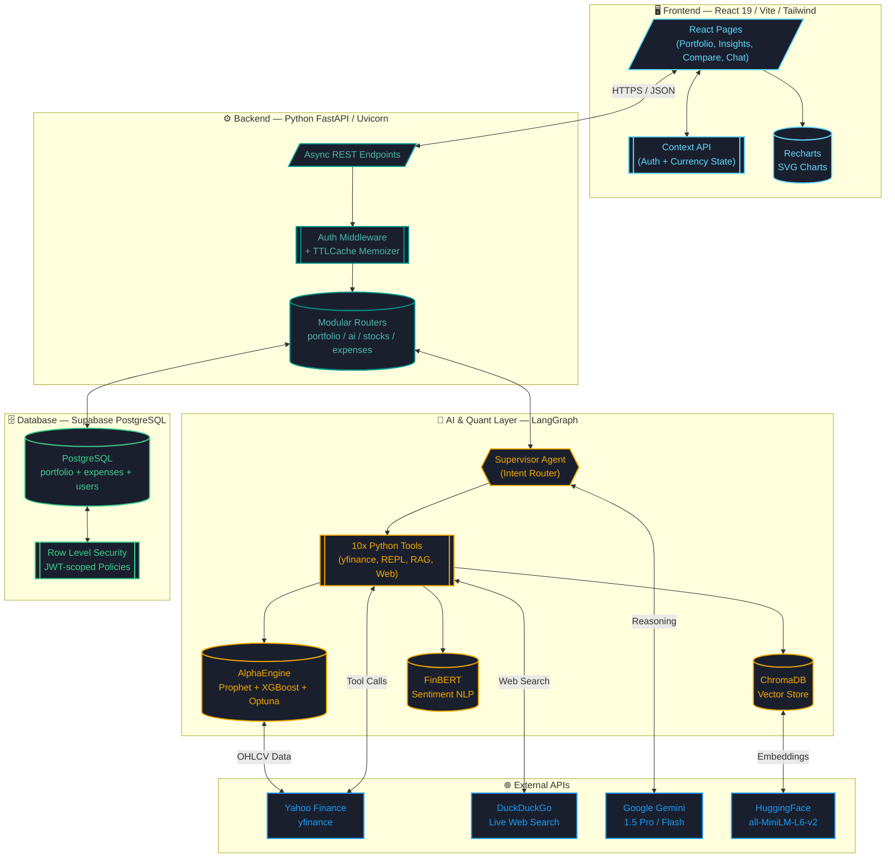

<div align="center">

# 💹 Finsights Nexus

### *Institutional-grade AI Wealth Intelligence for the Modern Retail Investor*

<br/>

[](https://react.dev/)
[](https://fastapi.tiangolo.com/)
[](https://www.python.org/)
[](https://supabase.com/)
[](https://langchain-ai.github.io/langgraph/)
[](https://huggingface.co/)
[](https://xgboost.ai/)
[](https://facebook.github.io/prophet/)

<br/>

> **Finsights Nexus** is not a chatbot wrapper. It is a fully-autonomous, multi-agent AI financial intelligence platform — equipped with a hybrid ML forecasting engine, Retrieval-Augmented Generation (RAG), live internet search, and real-time portfolio analytics — deployed as a production-grade microservice architecture.

<br/>

**[🌐 Live App](https://finsights-nexus.vercel.app) · [⚙️ API Docs](https://finsights-backend.onrender.com/docs) · [📹 Video Walkthrough](#)**

</div>

---

## 📑 Table of Contents

1. [The Problem & The Solution](#-the-problem--the-solution)
2. [Core Features](#-core-features)
3. [System Architecture](#-system-architecture)
4. [Technology Stack](#-technology-stack)
5. [AI & Machine Learning Deep Dive](#-ai--machine-learning-deep-dive)
6. [Security & Database Design](#-security--database-design)
7. [API Reference](#-api-reference)
8. [Engineering Challenges & Solutions](#-engineering-challenges--solutions)
9. [Local Development Setup](#-local-development-setup)
10. [Deployment Guide](#-deployment-guide)
11. [Future Roadmap](#-future-roadmap)

---

## 🧩 The Problem & The Solution

### The Problem with Retail Investing Today
Retail investors are forced to juggle a broken, fragmented ecosystem:

| Fragmented Tool | What Investors Use It For |
|---|---|
| Zerodha / Groww | Executing trades |
| Yahoo Finance / Screener.in | Checking live prices |
| Twitter / Reddit | Following market sentiment |
| ChatGPT | Asking financial questions (and getting hallucinated answers) |
| Excel / Sheets | Manually tracking P&L |

**The core flaw**: None of these talk to each other. And none of them can reason autonomously.

### The Solution: One Unified Intelligence Platform

Finsights Nexus converges every layer of financial intelligence into a single, secure, AI-native dashboard:

- 🧠 **No hallucination**: AI is constrained to tool-calling; it cannot invent stock prices.
- 📊 **Real-time data**: Live market prices, exchange rates, and batch portfolio valuation.
- 🔮 **Predictive edge**: A Hybrid Prophet + XGBoost ML model for 7-day forecasting.
- 🔒 **Bank-grade security**: PostgreSQL Row Level Security enforced at the database engine level.

---

## ⚡ Core Features

### 1. 💼 Portfolio Tracker
A persistent, cloud-synced investment portfolio — no spreadsheet needed.

- **Instant A-Z Stock Search**: Click the search bar and a comprehensive chip-grid of Indian NSE equities appears instantly — fully client-side, zero API latency.
- **Batch Price Fetching**: On page load, the backend extracts all your symbols and executes a single vectorized `yf.download()` batch call, fetching current prices for all holdings simultaneously. This reduces load times from ~15s (sequential) to **under 2 seconds**.
- **Live P&L Engine**: Automatically calculates invested capital, current market value, gain/loss (₹ & %), and portfolio allocation percentages.
- **Historical Growth Chart**: A time-series chart shows your portfolio's total value evolution — filtered to only show history from your signup date, even if historical stock data goes back years.
- **Cloud Persistence**: All holdings are stored in Supabase PostgreSQL and are protected by Row Level Security, invisible to any other user.

---

### 2. 🤖 Nexus AI — The Autonomous Financial Agent

> Nexus AI is not a chatbot. It is a **LangGraph-powered state machine** with access to 10 distinct Python tools.

When you ask a question, the AI does not guess. It:
1. **Reasons** about which tool to use (Supervisor Agent pattern).
2. **Executes** the appropriate Python function (not an LLM prediction).
3. **Observes** the real output.
4. **Synthesizes** a grounded, factual response.

#### The Full Toolbelt

| Tool | What It Does |
|------|-------------|
| `get_stock_details` | Fetches real-time price, 52-week H/L, sector via Yahoo Finance |
| `predict_stock_trend` | Invokes AlphaEngine (Prophet + XGBoost) for a live 7-day ML forecast |
| `run_ml_backtest` | Simulates a $10,000 algorithmic trading strategy on 2 years of historical data and renders the P&L as an interactive chart inside the chat |
| `get_financial_statements` | Pulls live income statements and balance sheets (revenue, net income, total assets) |
| `get_insider_trades` | Fetches officer/director buy-sell transactions to reveal executive conviction |
| `fetch_latest_news` | Retrieves real-time news headlines for any ticker via Yahoo Finance |
| `search_the_web` | **Live internet search** via DuckDuckGo — for today's breaking news the LLM hasn't seen |
| `search_financial_knowledge` | Performs cosine-similarity search on the ChromaDB RAG vector database for hallucination-free financial definitions |
| `generate_stock_chart_data` | Returns a JSON chart payload that the React frontend renders as a live interactive chart inside the chat window |
| `PythonREPLTool` | Gives the agent the ability to write and **execute arbitrary Python code** on-the-fly for complex mathematical queries |

#### Example Agent Flow
```
User: "Run a backtest on TCS.NS"

  ┌─ SUPERVISOR ──────────────────────────┐
  │  Classifies intent → BACKTEST REQUEST │
  └──────────────┬────────────────────────┘
                 │
  ┌─ run_ml_backtest(symbol="TCS.NS") ────┐
  │  1. Pulls 2 years yfinance data       │
  │  2. Trains Prophet on 75% train split │
  │  3. Simulates algo trading on 25% test│
  │  4. Returns JSON {type: "chart", ...} │
  └──────────────┬────────────────────────┘
                 │
  ┌─ REACT FRONTEND ──────────────────────┐
  │  Intercepts JSON payload              │
  │  Renders live Recharts chart in chat  │
  └───────────────────────────────────────┘
```

---

### 3. 📊 Stock Insights
Deep-dive fundamental and technical analysis for any NSE/BSE/US stock.

- Real-time price, volume, and market cap via `yfinance`
- 52-week high/low with visual range indicators
- Interactive historical price chart (7D / 1M / 3M / 1Y)
- AI-powered momentum analysis (Uptrend / Downtrend / Neutral) generated by the AlphaEngine
- A-Z instant chip-grid search — click to open, no typing required

---

### 4. ⚖️ Stock Comparison Engine
Side-by-side quantitative comparison of 2 or more assets.

- Overlay historical performance charts on the same timeline
- Compare fundamental metrics: P/E ratio, market cap, volume, sector
- Highlight divergence and correlation between assets
- Full A-Z chip-grid search for both assets simultaneously

---

### 5. 💸 Expense Tracker
Personal cash flow management integrated into the dashboard.

- Log income and expense transactions with category tags
- Persistent, per-user transaction history in Supabase
- Visual breakdown of spending by category

---

### 6. 🔐 Authentication System
Production-grade auth, not a toy login form.

- **Google OAuth 2.0** via Supabase — one-click login, no password management.
- **Email + Password** sign-up with email verification flow.
- **JWT Session Management**: Secure, short-lived tokens validated on every API call.
- **Password Reset**: Full forgot-password → email → reset flow implemented.

---

## 🏗️ System Architecture



---

## 🛠️ Technology Stack

### Frontend

| Technology | Version | Role | Why We Chose It |
|---|---|---|---|
| **React** | 19 | UI Framework | Latest concurrent rendering, zero-cost Suspense for async data |
| **Vite** | 7 | Build Tool | Sub-100ms HMR, ESBuild under the hood — 10x faster than Webpack |
| **Tailwind CSS** | 4 | Styling | JIT utility classes, zero-runtime CSS, custom Fintech design tokens |
| **Recharts** | 3 | Data Visualization | SVG-based rendering — no canvas lag when plotting 365-day stock data |
| **Lucide React** | Latest | Icons | Consistent, lightweight SVG icon system |
| **React Router DOM** | 7 | Client-side Routing | Nested routes, protected route guards |
| **Framer Motion** | 12 | Animations | GPU-accelerated, declarative micro-animations |

### Backend

| Technology | Version | Role | Why We Chose It |
|---|---|---|---|
| **FastAPI** | Latest | Web Framework | Native async, automatic OpenAPI docs, Pydantic validation |
| **Uvicorn** | Latest | ASGI Server | Highest throughput Python ASGI server for concurrent AI workloads |
| **yfinance** | Latest | Market Data | Free Yahoo Finance wrapper — real-time prices, financials, insider trades |
| **Pandas** | 2+ | Data Pipelines | Vectorized batch operations — processes 500 price rows in microseconds |
| **python-dotenv** | Latest | Config Management | Strict environment variable injection at process startup |

### AI & Machine Learning

| Technology | Version | Role | Why We Chose It |
|---|---|---|---|
| **LangGraph** | Latest | Agent Orchestration | Deterministic DAG-based state machine; prevents LLM loops & hallucination |
| **LangChain** | Latest | Tool Framework | Standardized `@tool` decorator pattern for binding Python functions to the LLM |
| **Google Gemini** | 1.5 Pro/Flash | LLM Engine | Best-in-class reasoning + tool-calling, low cost at scale |
| **Facebook Prophet** | Latest | Time Series Base | Additive seasonality decomposition; handles NSE market holidays natively |
| **XGBoost** | Latest | Residual ML Predictor | Non-linear gradient boosting on technical indicators (RSI, MACD, SMA) |
| **Optuna** | Latest | Hyperparameter Tuning | Runs 10 Bayesian optimization trials on-the-fly per prediction request |
| **TA-Lib (ta)** | Latest | Technical Indicators | Computes RSI, MACD, SMA feature vectors for XGBoost |
| **ChromaDB** | Latest | Vector Database | Local, persistent vector store for RAG semantic search |
| **HuggingFace Embeddings** | all-MiniLM-L6-v2 | Sentence Embeddings | Fast, lightweight encoder for financial document chunks |
| **FinBERT** | ProsusAI | Sentiment Analysis | NLP model fine-tuned on financial news corpora |
| **duckduckgo-search** | Latest | Web Search Tool | Privacy-first, no API key required, live internet access for the AI |

### Database & Auth

| Technology | Role | Why We Chose It |
|---|---|---|
| **Supabase** | BaaS Platform | Managed PostgreSQL, Google OAuth, RLS, and real-time in one SDK |
| **PostgreSQL** | Relational DB | ACID compliance — no partial writes on financial transactions |
| **Row Level Security** | Data Isolation | Database-engine-level policy enforcement; immune to API-layer bugs |
| **Google OAuth 2.0** | Authentication | Zero password management; institutional-standard identity provider |

---

## 🧠 AI & Machine Learning Deep Dive

### AlphaEngine — Hybrid Prophet + XGBoost Forecaster

AlphaEngine (`backend/services/alpha_engine.py`) is a custom-built, two-stage time-series forecasting model. It outperforms naive ARIMA or standalone Random Forest approaches by decomposing the forecasting problem into two orthogonal components:

```
Final Prediction = Prophet_Baseline + XGBoost_Residual
```

**Stage 1 — Macro Trend Extraction (Prophet)**
- Trains Facebook Prophet on 1 year of daily close prices.
- Captures yearly seasonality, weekly patterns, and market holiday effects.
- Produces a smooth baseline forecast for the next N business days.

**Stage 2 — Micro-Volatility Correction (XGBoost + Optuna)**
- Computes residuals: `residual[t] = actual[t] - prophet_pred[t]`
- Engineers 7 technical indicator features per timestep:

| Feature | Description |
|---|---|
| `sma_5` | 5-Day Simple Moving Average |
| `sma_20` | 20-Day Simple Moving Average |
| `rsi` | 14-Day Relative Strength Index |
| `macd` | MACD Line |
| `macd_signal` | MACD Signal Line |
| `close_lag_1` | Yesterday's closing price |
| `close_lag_2` | The day before's closing price |

- Runs **10 Optuna Bayesian trials** to find optimal `n_estimators`, `learning_rate`, and `max_depth`.
- Trains XGBoost on all available data using the tuned hyperparameters.
- At inference: iteratively predicts residuals day-by-day, feeding each prediction back as a lag feature.

### RAG — Retrieval-Augmented Generation (ChromaDB)

To enforce factual, grounded financial answers:

1. A static financial knowledge corpus (definitions, concepts, investing frameworks) is chunked using `RecursiveCharacterTextSplitter` (chunk_size=1000, overlap=200).
2. Each chunk is embedded using HuggingFace `all-MiniLM-L6-v2` into a dense 384-dimension vector.
3. Vectors are persisted in a local **ChromaDB** vector store.
4. The LangGraph Agent exposes `search_financial_knowledge` as a tool. When a user asks a conceptual question, the agent triggers a **cosine similarity search** against the ChromaDB store and injects the top-2 matching chunks as grounding context into the Gemini prompt.

This architecture guarantees: if the LLM doesn't know something from its training data, it **must** query the vector database before answering.

---

## 🗄️ Security & Database Design

### Schema

```sql
-- Users managed entirely by Supabase Auth
-- Portfolio table: scoped to auth.uid()
CREATE TABLE portfolio (
  id          UUID PRIMARY KEY DEFAULT gen_random_uuid(),
  user_id     UUID NOT NULL REFERENCES auth.users(id) ON DELETE CASCADE,
  stock_symbol TEXT NOT NULL,
  company_name TEXT NOT NULL,
  quantity    NUMERIC NOT NULL,
  buy_price   NUMERIC NOT NULL,
  created_at  TIMESTAMPTZ DEFAULT NOW()
);

-- Expenses table
CREATE TABLE expenses (
  id          UUID PRIMARY KEY DEFAULT gen_random_uuid(),
  user_id     UUID NOT NULL REFERENCES auth.users(id) ON DELETE CASCADE,
  amount      NUMERIC NOT NULL,
  category    TEXT NOT NULL,
  description TEXT,
  date        DATE NOT NULL,
  type        TEXT CHECK (type IN ('income', 'expense')),
  created_at  TIMESTAMPTZ DEFAULT NOW()
);
```

### Row Level Security Policies

```sql
-- Portfolio: Absolute user isolation
ALTER TABLE portfolio ENABLE ROW LEVEL SECURITY;

CREATE POLICY "select_own_portfolio" ON portfolio
  FOR SELECT USING (auth.uid() = user_id);

CREATE POLICY "insert_own_portfolio" ON portfolio
  FOR INSERT WITH CHECK (auth.uid() = user_id);

CREATE POLICY "delete_own_portfolio" ON portfolio
  FOR DELETE USING (auth.uid() = user_id);
```

Even if the FastAPI backend had a critical bug that accidentally queried all portfolios, the **PostgreSQL engine itself** would evaluate the JWT and reject the query. This is institutional-grade data isolation.

---

## 🌐 API Reference

| Method | Endpoint | Auth | Description |
|--------|----------|------|-------------|
| `GET` | `/api/portfolio/` | ✅ JWT | Returns full portfolio with live market prices, P&L, allocations |
| `POST` | `/api/portfolio/` | ✅ JWT | Add a new stock holding |
| `DELETE` | `/api/portfolio/{id}` | ✅ JWT | Remove a holding |
| `GET` | `/api/portfolio/history` | ✅ JWT | Time-series portfolio valuation from signup date |
| `POST` | `/api/ai/chat` | ✅ JWT | Send a message to the LangGraph multi-agent system |
| `GET` | `/api/stocks/{symbol}` | ❌ Public | Live price, fundamentals, historical OHLCV |
| `GET` | `/api/stocks/exchange-rates` | ❌ Public | Live USD/INR and other currency rates |
| `GET` | `/api/market/status` | ❌ Public | NSE/NYSE open or closed status |
| `GET` | `/api/expenses/` | ✅ JWT | Fetch user expense transactions |
| `POST` | `/api/expenses/` | ✅ JWT | Log a new expense/income |
| `GET` | `/docs` | ❌ Public | Auto-generated FastAPI / Swagger UI |

---

## 🚧 Engineering Challenges & Solutions

### Challenge 1: LLM Hallucination on Live Financial Data
**Problem:** A standard LLM will confidently invent stock prices. Asking ChatGPT "What is TCS trading at today?" yields a hallucinated, potentially harmful answer.

**Solution:** Implemented the **LangGraph Supervisor-Worker** pattern. The LLM is stripped of the ability to generate financial numbers from training data. It can *only* return answers by calling deterministic Python tool functions (`get_stock_details`, `predict_stock_trend`). The tools hit real APIs and return ground-truth data. The LLM only formats and synthesizes the response.

### Challenge 2: Portfolio Load Time (15s → 2s)
**Problem:** Fetching the current price for each portfolio holding sequentially with `ticker.history(period="1d")` took ~1.5 seconds per stock. A 10-stock portfolio would take **15 seconds to load**.

**Solution:** Replaced sequential single-ticker calls with a single vectorized batch call:
```python
# BEFORE: 15 seconds for 10 stocks
for symbol in symbols:
    price = yf.Ticker(symbol).history(period="1d")["Close"].iloc[-1]

# AFTER: 1.8 seconds for 10 stocks
market_data = yf.download(symbols, period="1d", progress=False)
close_prices = market_data.xs('Close', axis=1, level=0)
```

### Challenge 3: Docker Build Bottleneck (30min → 3min)
**Problem:** Containerizing `prophet`, `xgboost`, `torch`, and `sentence-transformers` in Docker resulted in 30+ minute build times that destroyed the development cycle.

**Solution:** Abandoned containerization for development. Migrated to native `uvicorn` (backend) and `pnpm run dev` (frontend). Deployed to Render's native Python environment (which handles `pip install` natively) and Vercel for the frontend. Build times dropped to 3 minutes.

### Challenge 4: Duplicate Import Build Error (Vite/Babel)
**Problem:** An accidental `import { Plus } from 'lucide-react'` appearing twice in `Compare.jsx` caused Babel to throw an `Identifier 'Plus' has already been declared` error, crashing the entire Vite dev server with a white screen.

**Solution:** Audited all import statements across the affected file, removed the duplicate declaration, and validated the build before committing. Lesson: always run `pnpm build` before pushing feature branches.

---

## ⚙️ Local Development Setup

### Prerequisites
- Node.js 18+ and `pnpm` (`npm i -g pnpm`)
- Python 3.11+
- A [Supabase](https://supabase.com/) project with Google OAuth configured
- A [Google AI Studio](https://aistudio.google.com/) account for the Gemini API key

### Step 1: Clone the Repository
```bash
git clone https://github.com/abhiram5856/finsights-nexus.git
cd finsights-nexus
```

### Step 2: Backend Setup
```bash
cd backend

# Create and activate virtual environment
python -m venv venv
.\venv\Scripts\Activate.ps1   # Windows
source venv/bin/activate        # macOS / Linux

# Install all dependencies (ML, AI, API)
pip install -r requirements.txt

# Configure secrets
cp .env.example .env
```

Edit `backend/.env`:
```env
GEMINI_API_KEY="your_google_gemini_api_key"
SUPABASE_URL="https://your-project.supabase.co"
SUPABASE_KEY="your_supabase_service_role_key"
```

```bash
# Start the backend server
uvicorn main:app --reload
# → Running on http://localhost:8000
# → Swagger UI at http://localhost:8000/docs
```

### Step 3: Frontend Setup
Open a new terminal:
```bash
cd frontend

# Install dependencies
pnpm install

# Configure environment
cp .env.example .env
```

Edit `frontend/.env`:
```env
VITE_API_URL="http://localhost:8000"
VITE_SUPABASE_URL="https://your-project.supabase.co"
VITE_SUPABASE_ANON_KEY="your_supabase_anon_key"
```

```bash
# Start the dev server
pnpm run dev
# → Running on http://localhost:5173
```

---

## 🚀 Deployment Guide

### Backend → Render.com
1. Create a new **Web Service** on [Render](https://render.com/)
2. Connect your GitHub repository
3. Set **Root Directory** → `backend`
4. Set **Build Command** → `pip install -r requirements.txt`
5. Set **Start Command** → `uvicorn main:app --host 0.0.0.0 --port $PORT`
6. Add Environment Variables: `GEMINI_API_KEY`, `SUPABASE_URL`, `SUPABASE_KEY`

### Frontend → Vercel
1. Import your GitHub repository on [Vercel](https://vercel.com/)
2. Set **Root Directory** → `frontend`
3. Framework Preset → **Vite**
4. Add Environment Variables:
   - `VITE_API_URL` → `https://your-render-app.onrender.com`
   - `VITE_SUPABASE_URL`
   - `VITE_SUPABASE_ANON_KEY`

### Post-Deployment: Supabase Auth Config
In your Supabase Dashboard → **Authentication → URL Configuration**:
- **Site URL**: `https://your-app.vercel.app`
- **Redirect URLs**: `https://your-app.vercel.app/**`

---

## 🔮 Future Roadmap

| Priority | Feature | Description |
|---|---|---|
| 🔥 High | **WebSocket Streaming** | Replace REST portfolio polling with Zerodha Kite Connect WebSocket for millisecond tick-level updates |
| 🔥 High | **Price Alert System** | Celery + Redis worker queue to send email/push notifications when portfolio drops >5% intraday |
| 🟡 Medium | **FinBERT Sentiment Dashboard** | Visualize real-time sentiment scores for all portfolio holdings as a heat map |
| 🟡 Medium | **Multi-Asset Backtesting** | Allow users to compare their AlphaEngine strategy vs. Nifty 50 benchmark |
| 🟢 Low | **Portfolio Sharing** | Generate public, read-only, shareable portfolio links |
| 🟢 Low | **Zerodha Integration** | OAuth-based brokerage sync for automatic trade import |

---

## 📁 Project Structure

```
finsights-nexus/
├── backend/
│   ├── main.py                    # FastAPI app entry point
│   ├── db.py                      # Supabase client factory
│   ├── requirements.txt           # All Python dependencies
│   ├── routes/
│   │   ├── ai.py                  # LangGraph agent endpoint
│   │   ├── portfolio.py           # Portfolio CRUD + batch pricing
│   │   ├── stocks.py              # Market data endpoints
│   │   ├── expenses.py            # Expense tracking
│   │   ├── market.py              # Exchange status
│   │   └── user.py                # User profile
│   └── services/
│       ├── alpha_engine.py        # Prophet + XGBoost ML model
│       ├── multi_agent.py         # LangGraph state machine
│       ├── agent_tools.py         # All 10 AI tool definitions
│       ├── rag_pipeline.py        # ChromaDB + HuggingFace RAG
│       └── auth.py                # JWT validation
├── frontend/
│   ├── src/
│   │   ├── pages/
│   │   │   ├── Dashboard.jsx      # Main portfolio dashboard
│   │   │   ├── Portfolio.jsx      # Portfolio tracker + P&L
│   │   │   ├── StockInsights.jsx  # Stock deep-dive analysis
│   │   │   ├── Compare.jsx        # Multi-asset comparison
│   │   │   ├── Expenses.jsx       # Expense tracker
│   │   │   └── Landing.jsx        # Public landing page
│   │   ├── components/
│   │   │   ├── AIChatWidget.jsx   # Nexus AI chat interface
│   │   │   ├── StockAutocomplete.jsx # A-Z chip grid search
│   │   │   └── Navbar.jsx
│   │   ├── context/
│   │   │   ├── AuthContext.jsx    # JWT + session management
│   │   │   └── CurrencyContext.jsx # Live currency conversion
│   │   └── data/
│   │       └── indianStocks.js    # Local A-Z NSE stock database
│   └── vercel.json                # SPA redirect rules
└── docker-compose.yml
```

---

## 📄 License

Distributed under the **MIT License**. See [`LICENSE`](./LICENSE) for more information.

---

<div align="center">

**Built by [Abhiram M.](https://github.com/abhiram5856)**

*Real-time data by Yahoo Finance · Generative AI by Google DeepMind · Embeddings by HuggingFace*

<br/>

⭐ **If this project helped you, please give it a star!** ⭐

</div>
